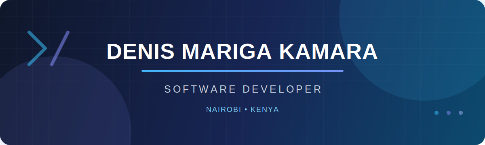

<div align="center">
  
</div>

<div align="center">
  <h1>Hi, I'm Denis Mariga Kamara 👋</h1>
  <h3>IT Professional • Software Developer • Lifelong Learner</h3>
  <p>Based in Nairobi, Kenya 🇰🇪</p>

  <a href="https://github.com/KamaraDenis">
    
  </a>
  <a href="https://www.linkedin.com/in/denis-mariga-35a719344/">
    
  </a>
</div>

---

## About Me

```javascript
const denis = {
  fullName: "Denis Mariga Kamara",
  location: "Nairobi, Kenya",
  background: "Information Technology",
  focus: ["Software Development", "Problem Solving", "Continuous Learning"],
  mindset: "Learn, build, improve, and share."
};
```

- 💻 I enjoy turning ideas and real-world problems into useful digital solutions.
- 🌱 I am continually growing my software development and modern technology skills.
- 🤝 I am open to collaborating on meaningful projects and learning with other developers.
- 💬 Ask me about technology, software, and building practical solutions.
- 🎯 My goal is to write useful, maintainable code that creates genuine value.

## Languages and Tools

<p align="left">
  
</p>

## What I'm Working On

- Building projects that strengthen my development skills
- Exploring better ways to design and deliver reliable software
- Learning from open-source communities and contributing where I can
- Growing a portfolio that reflects both technical ability and practical impact

## GitHub Stats

<div align="center">
  
  
</div>

<div align="center">
  
</div>

## Connect With Me

<p align="left">
  <a href="https://www.linkedin.com/in/denis-mariga-35a719344/" target="_blank">
    
  </a>
  <a href="mailto:denismariga50@gmail.com">
    
  </a>
</p>

---

<div align="center">
  <p><strong>Great software starts with curiosity and grows through consistency.</strong></p>
  <p>Thanks for visiting. Explore my repositories and leave a ⭐ on anything you find useful.</p>
</div>


